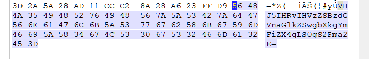
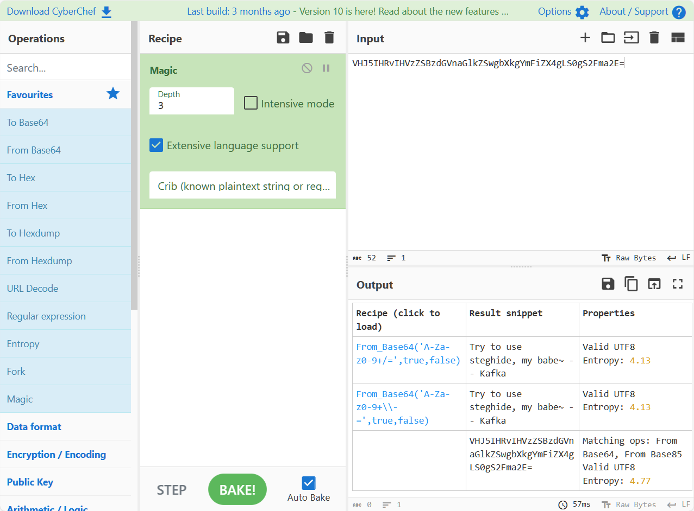
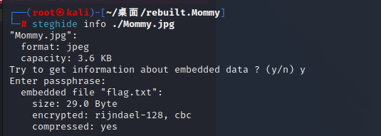
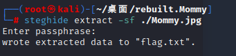
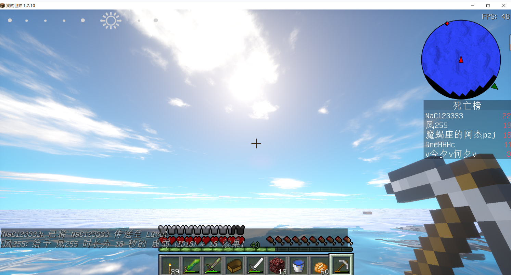
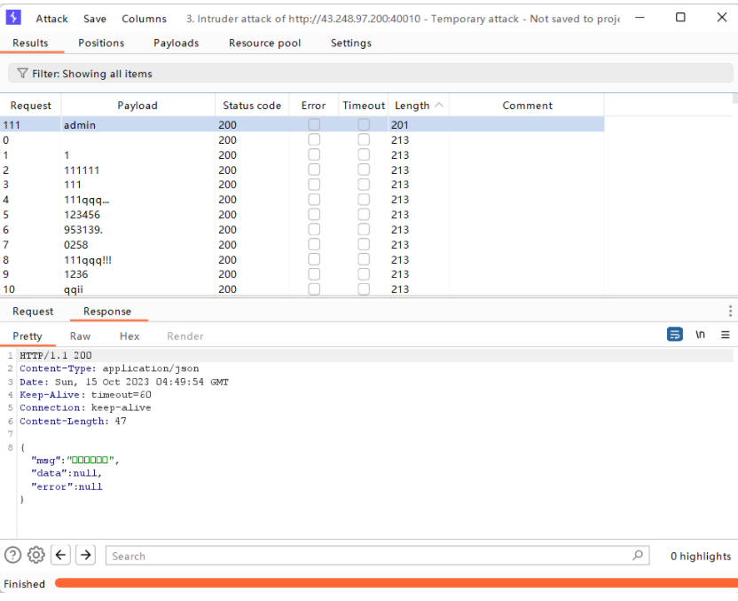
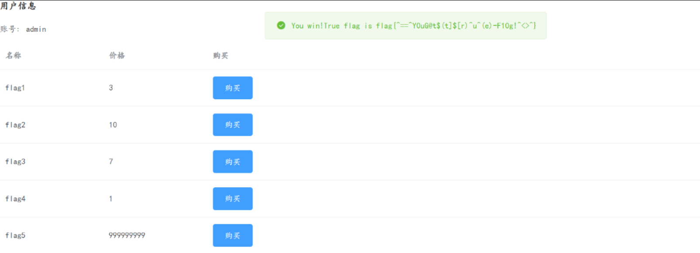
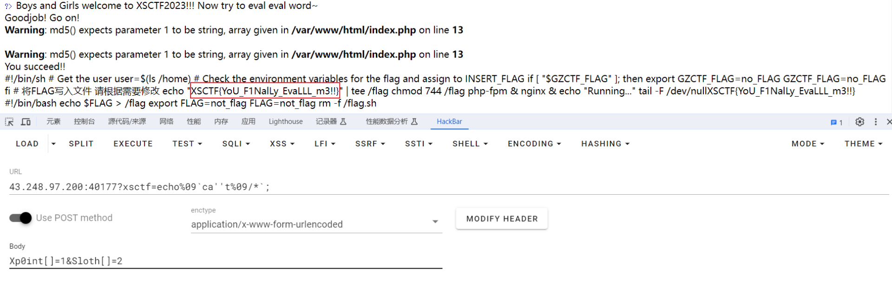

# Misc

## 【新生专属】Mommy_Kafka

打开压缩包，发现要密码，结合所学的压缩包加密，看看其十六进制长什么样，判断其是否真加密；打开一看，发现50 4B 01 02 14 00开头和结尾的，不是09（或奇数）00，所以判定为伪加密；直接用winrar的修复功能，得到一个未加密的压缩包：rebuilt.Mommy.zip；然后看看result文件中的图片的ANSI ASCII，发现末尾有一串数字很可疑



二话不说，直接用[Magic - CyberChef (gchq.github.io)](https://gchq.github.io/CyberChef/#recipe=Magic(3,false,true,'')&input=VkhKNUlIUnZJSFZ6WlNCemRHVm5hR2xrWlN3Z2JYa2dZbUZpWlg0Z0xTMGdTMkZtYTJFPQ)的magic模块来分析一下字符串可能的加密方式，发现好像是base65的编码，然后提示用steghide来解



这时候就祭出kali虚拟机来跑一波，先看看有没有隐藏文件，发现有，那就提取文件得到一个txt文件





FLAG：XSCTF{M0mmy_L0v3_Me_th3_mo5t}

## 【新生专属】Oursecret_for_zero

根据题目描述得知使用`oursecret`这个工具，这个工具可以把图片的隐藏信息拿出来但是需要密码；`passwd.txt`打开一看结合题目应该是0宽字符隐写，通过[在线网站](http://330k.github.io/misc_tools/unicode_steganography.html)的解密得到password为`A_n3w_ste9_way`然后利用`oursecret`从图片中拿到隐藏的`flag.txt`，拿到flag

FLAG：XSCTF{WeLc0m3_to_s7eg_w0rld}


## 【新生专属】excccel

打开excel发现三个看起来空空的表格，改后缀zip解压后得到excel的源文件，发现`sheet1`这个表里面有的单元格是有值的，查了一下<row>的s属性是代表样式索引，本来以为改`style.xml`就可以拿到填充颜色的单元格，但是一直改不对，无奈手搓，最后发现是个二维码（尊嘟很好奇正确做法qwq


FLAG：XSCTF{WHOoo_ME55_the_EXCcCeL}


## word心

改后缀名为zip解压得到一个word文件夹，双击在edge打开`document.xml`搜索flag找到flag的前半段

```shell
xsctf{Y0u_g07_h@lf_my_hear7_
```

在word文件夹里面有`FLAG2.xml`文件双击打开发现在edge显示不了于是用Notepad++打开得到第二段flag

```shell
g1v3_y0u_an0ther_h@lf}
```

FLAG：xsctf{Y0u_g07_h@lf_my_hear7_g1v3_y0u_an0ther_h@lf}


## MC的picture

双击打开发现联想商店有个`图片编辑王`的软件可以打开，根据提示把排行榜第一的名字作为FLAG提交即可



FLAG：XSCTF{NaCl2333}

# Crypto

## 【新生专属】Shuffle

题目很简单就是按照所给的操作序列反向操作回去即可，过程如下：

```shell
K876J58JQ97A9J3840 => 9J38408JQ97AK876J5 => 97AK876J59J38408JQ => 8408JQ6J59J397Ak87 =>
80J65J9A848Qj937K7 => 48QJ937K780J65J9A8 => 4Q97706JA8J3K8J598 => K8J5986JA8J34Q9770 =>
8J34Q9770K8J5986JA (Flag)
```

FLAG：XSCTF{8J34Q9770K8J5986JA}


# Web

## canyoupassit

前面的MD5绕过网上找找就过了，后面要传两个当前时间开头的字符串，手动传肯定不行，想着写脚本，通过比当前时间多一秒并一直发送请求直至时间刚好重合即可，exp如下：

```python
import requests
import time

url = 'http://43.248.97.200:40038/'

timestamp = int(time.time()) + 1
data = {'a1': 1, 'b1': 2, 'key': '0e215962017', 'a2': str(timestamp) + '111', 'b2': timestamp}

while True:
    res = requests.post(url, data)
    print(res.text)
```

FLAG：flag{y0v|nDeedReA11yk$nwAb0uTMD5!~ _ ~^_^}


## reallyExpensive

注册的时候想用admin当用户名，发现用户已存在，想着能不能用admin作为用户名登录，然后用burp爆破出密码是admin



然后后面就有点戏剧性了，进去之后发现买的钱不够，想不出来，之后重新登陆的时候发现不知道哪个好心人把余额刷高了，刚好直接捡漏……



FLAG：当时没保存，截图有，有点复杂懒得再打一遍了（狗头


## 【新生专属】eval_eval_我的

观察题目可以知道主要是先绕过MD5强比较执行xsctf的命令，绕过MD5强比较直接数组绕过即可，对于xsctf的命令一开始用system()函数但是一直报错什么左括号多余啥的，试了好久后面直接用echo函数，先echo%09\`ls%09\`发现根目录下有flag（%09主要是正则匹配会匹配空格好像），不过很奇怪直接cat没有打印，感觉可能是cat的时候过滤了flag这个关键字所以直接cat *拿到根目录下所有东西，至于cat会被正则匹配到直接单引号绕过即可，最后拿到flag

payload：

```shell
43.248.97.200:40177?xsctf=echo%09`ca''t%09/*`;

POST:
Xp0int[]=1&Sloth[]=2
```



FLAG：XSCTF{YoU_F1NaILy_EvaLLL_m3!!}


# Reverse

## PYTEA

唯一写的一道逆向，根据题目得知应该是python的逆向，先用`pyinstxtractor`解包然后对`where_is_my_tea.pyc`进行反编译得到python文件，然后审计代码写exp，如下

```python
from ctypes import c_uint32


def string_key_to_int_array(key):
    key_int_array = []
    for char in key:
        key_int_array.append(ord(char))

    return key_int_array


def int_array_to_string(int_array):
    text = ""
    for i in range(0, len(int_array), 4):
        int_value = (int_array[i] << 24) + (int_array[i + 1] << 16) + (int_array[i + 2] << 8) + int_array[i + 3]
        char = chr(int_value)
        text += char

    return text


def decrypt_tea(v, k):
    a, b, c, d = (c_uint32(v[0]), c_uint32(v[1]), c_uint32(v[2]), c_uint32(v[3]))
    k0, k1, k2, k3 = (k[0], k[1], k[2], k[3])
    delta = 2654435769
    sum = c_uint32(delta << 5)

    for i in range(32):
        d.value -= (c.value << 4) + k2 ^ c.value + sum.value ^ (c.value >> 5) + k3
        c.value -= (d.value << 4) + k0 ^ d.value + sum.value ^ (d.value >> 5) + k1
        b.value -= (a.value << 4) + k2 ^ a.value + sum.value ^ (a.value >> 5) + k3
        a.value -= (b.value << 4) + k0 ^ b.value + sum.value ^ (b.value >> 5) + k1
        sum.value -= delta

    v[0] = a.value
    v[1] = b.value
    v[2] = c.value
    v[3] = d.value
    return v


try_arr = [4290104173, 498681769, 2467793253, 1446958341, 4290104173, 498681769, 3506676220, 3930177928, 4290104173,
           498681769, 2119578006, 1735799975, 4290104173, 498681769, 998166288, 1533730069, 4290104173, 498681769,
           4038291621, 2403882153, 4290104173, 498681769, 2467793253, 1446958341, 4290104173, 498681769, 3883478681,
           1516481470, 4290104173, 498681769, 4038291621, 2403882153, 4290104173, 498681769, 3028035458, 2248133075,
           4290104173, 498681769, 1256740478, 3840002295, 4290104173, 498681769, 3506676220, 3930177928, 4290104173,
           498681769, 1565438833, 2700198155, 4290104173, 498681769, 3270843981, 1371444109, 4290104173, 498681769,
           4038291621, 2403882153, 4290104173, 498681769, 4265779772, 2371730556, 4290104173, 498681769, 2663769111,
           401575738, 4290104173, 498681769, 998166288, 1533730069, 4290104173, 498681769, 3506676220, 3930177928,
           4290104173, 498681769, 1259602668, 877012692, 4290104173, 498681769, 1565438833, 2700198155, 4290104173,
           498681769, 4038291621, 2403882153, 4290104173, 498681769, 2467793253, 1446958341, 4290104173, 498681769,
           2999503208, 285984659, 4290104173, 498681769, 4120542045, 3307257413]

grouped_elements = [try_arr[i:i + 4] for i in range(0, len(try_arr), 4)]
# print(grouped_elements)

key_str = 'Sloth'
key = string_key_to_int_array(key_str)

for i in range(len(grouped_elements)):
    group = grouped_elements[i]
    processed_group = decrypt_tea(group, key)
    grouped_elements[i] = processed_group

try_arr = [val for group in grouped_elements for val in group]

flag = int_array_to_string(try_arr)
print(flag)  # T1m3_T0_DR1NK_CE31ON_Tea

```

FLAG：XSCTF{T1m3_T0_DR1NK_CE31ON_Tea}


